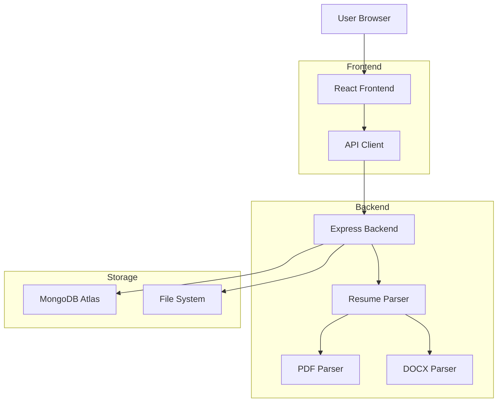
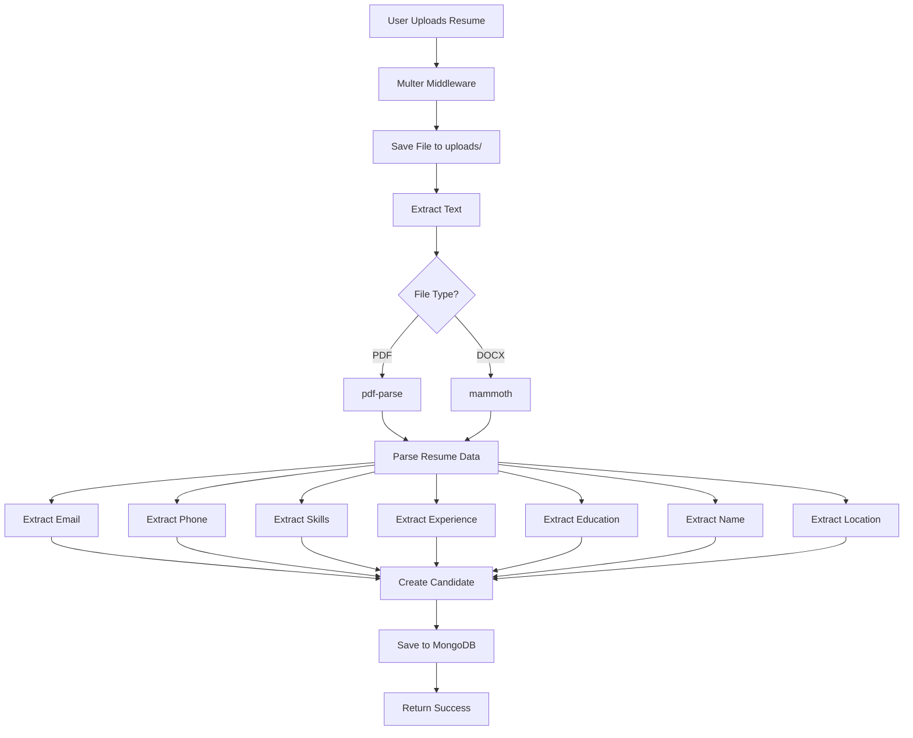
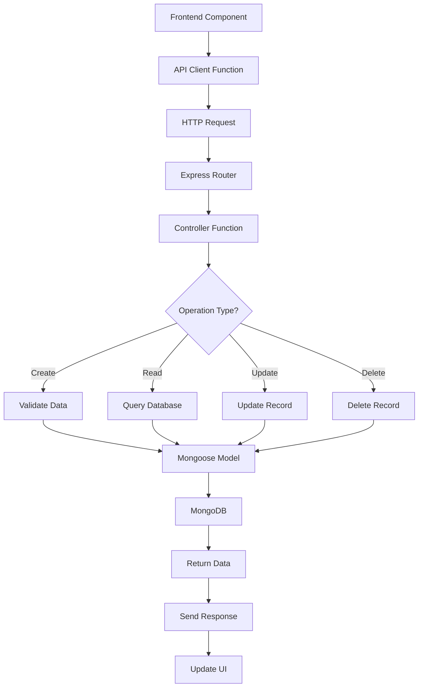
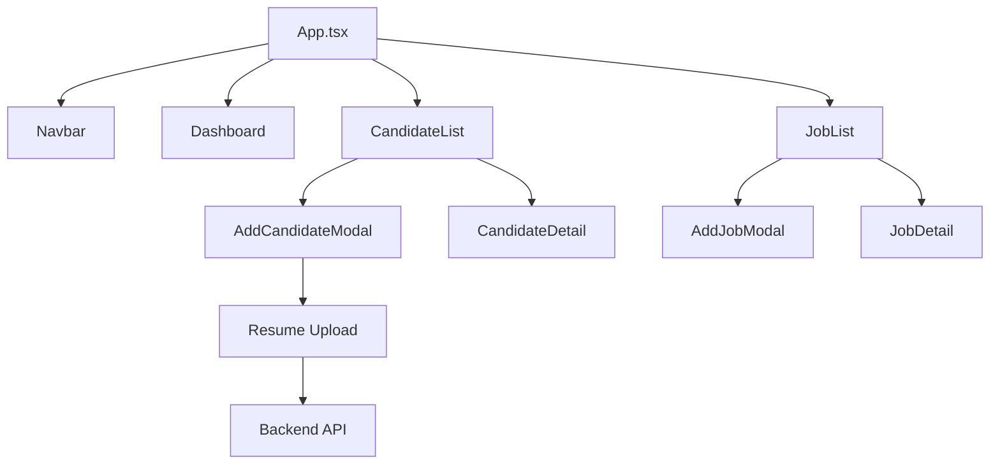
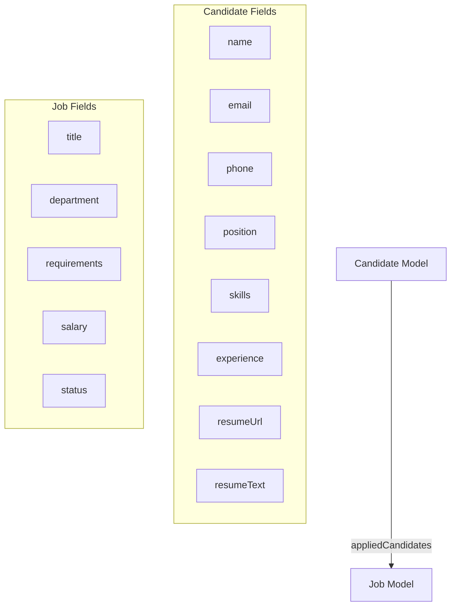

# System Architecture

## High-Level Architecture



## Resume Upload Flow



## API Request Flow



## Component Structure



## Data Models



## File Organization

```
project/
├── frontend/
│   ├── src/
│   │   ├── api/              → API communication layer
│   │   ├── components/       → React components
│   │   └── types/            → TypeScript definitions
│   └── package.json
│
├── backend/
│   ├── src/
│   │   ├── config/           → Configuration files
│   │   │   ├── database.js   → MongoDB connection
│   │   │   └── multer.js     → File upload setup
│   │   ├── controllers/      → Business logic
│   │   │   ├── candidateController.js
│   │   │   └── jobController.js
│   │   ├── models/           → Data schemas
│   │   │   ├── Candidate.js
│   │   │   └── Job.js
│   │   ├── routes/           → API endpoints
│   │   │   ├── candidateRoutes.js
│   │   │   └── jobRoutes.js
│   │   ├── utils/            → Helper functions
│   │   │   └── resumeParser.js
│   │   └── server.js         → Express app
│   ├── uploads/              → Resume files
│   └── package.json
│
└── MongoDB Atlas             → Cloud database
```

## Technology Stack

### Frontend
- **Framework**: React 18.3
- **Language**: TypeScript
- **Build Tool**: Vite 5.4
- **Styling**: TailwindCSS 3.4
- **Icons**: Lucide React
- **State**: React Hooks (useState, useEffect)

### Backend
- **Runtime**: Node.js 22.20
- **Framework**: Express 4.18
- **Database**: MongoDB (Mongoose 8.0)
- **File Upload**: Multer 1.4
- **Resume Parsing**: 
  - pdf-parse 1.1 (PDF files)
  - mammoth 1.6 (DOCX files)
- **Environment**: dotenv 16.3
- **CORS**: cors 2.8

### Database
- **Service**: MongoDB Atlas
- **Cluster**: Cluster0
- **Region**: Cloud-based
- **Connection**: mongoose ODM

## Security Measures

1. **File Upload Security**
   - File type validation (whitelist)
   - File size limits (5MB)
   - Unique filename generation
   - Safe file storage location

2. **Database Security**
   - MongoDB Atlas encryption
   - Environment variables for credentials
   - Connection string security
   - Email uniqueness validation

3. **API Security**
   - CORS enabled for specific origins
   - Input validation via Mongoose schemas
   - Error message sanitization
   - No sensitive data in responses

4. **Data Validation**
   - Required field validation
   - Email format validation
   - Phone number format validation
   - Enum validation for status fields

## Performance Considerations

1. **Frontend**
   - Component-level state management
   - Efficient re-rendering
   - Lazy loading for modals
   - Optimized search filtering

2. **Backend**
   - Indexed database queries
   - File cleanup on errors
   - Streaming file uploads
   - Efficient text parsing

3. **Database**
   - Indexed email field (unique)
   - Indexed dates for sorting
   - Efficient query patterns
   - Connection pooling via Mongoose

## Scalability Options

### Current Setup (Single Server)
- Good for: Up to 10,000 candidates
- Concurrent users: 50-100
- File storage: Local filesystem

### Future Enhancements
1. **Cloud Storage**: Move uploads to AWS S3 or Azure Blob
2. **Caching**: Add Redis for frequently accessed data
3. **Load Balancing**: Multiple backend instances
4. **CDN**: Static asset delivery
5. **Search Engine**: Elasticsearch for advanced search
6. **Queue System**: Background processing for resume parsing
7. **Microservices**: Separate resume parsing service

## Deployment Architecture

### Development (Current)
```
localhost:5173 (Frontend) → localhost:5000 (Backend) → MongoDB Atlas
```

### Production (Recommended)
```
Domain.com (Frontend - Vercel/Netlify)
  ↓
api.domain.com (Backend - Heroku/Railway/AWS)
  ↓
MongoDB Atlas (Database)
  +
AWS S3 (File Storage)
```

## API Response Format

### Success Response
```json
{
  "id": "507f1f77bcf86cd799439011",
  "name": "John Doe",
  "email": "john@example.com",
  "skills": ["React", "Node.js"],
  ...
}
```

### Error Response
```json
{
  "message": "Error description",
  "error": "Detailed error message"
}
```

## Environment Variables

### Backend (.env)
```
MONGODB_URI=mongodb+srv://...
PORT=5000
```

### Frontend (Vite)
```javascript
// In src/api/index.ts
const API_BASE_URL = 'http://localhost:5000/api';
```

## Resume Parsing Pipeline

1. **Upload** → Multer receives file
2. **Storage** → Save to `uploads/` directory
3. **Detection** → Determine file type (PDF/DOCX)
4. **Extraction** → Extract text content
5. **Parsing** → Apply regex patterns
6. **Validation** → Check required fields
7. **Storage** → Save to MongoDB
8. **Cleanup** → On error, delete uploaded file
9. **Response** → Return parsed data + candidate ID

## Error Handling Strategy

### Frontend
- User-friendly error messages
- Loading indicators
- Retry mechanisms
- Form validation feedback

### Backend
- Try-catch blocks
- Mongoose validation errors
- File operation errors
- Database connection errors
- Detailed logging

### Database
- Schema validation
- Unique constraint handling
- Connection timeout handling
- Transaction support (where applicable)
